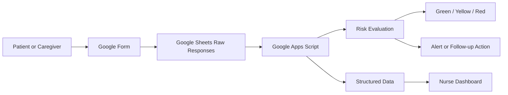

# ChemoCare Track — Project Summary

## 1. Project Overview

**ChemoCare Track** is a lightweight chemotherapy follow-up and symptom-monitoring system built with Google Workspace.

The project uses:

- **Google Forms** to collect patient or caregiver follow-up responses.
- **Google Sheets** to store and organize submitted data.
- **Google Apps Script** to process responses, evaluate patient risk, and provide a web dashboard.
- **Apps Script Web App** to give nurses or care staff a simple dashboard view.

The main objective is to help healthcare staff review post-chemotherapy symptoms, identify potentially high-risk patients, and prioritize follow-up actions.

---

## 2. High-Level Data Flow



Simplified workflow:

```text
Patient submits Google Form
        ↓
Response is stored as one row in Google Sheets
        ↓
Google Apps Script reads and validates the response
        ↓
Symptoms are evaluated using risk rules
        ↓
Patient is classified as Green, Yellow, or Red
        ↓
Dashboard is updated for nurse review
        ↓
High-risk cases can be flagged for follow-up
```

---

## 3. Google Form

The Google Form is used as the patient-facing assessment form.
Each submission contains patient details, treatment information, emergency contact information, and reported symptoms.

### Main information collected

- Submission timestamp
- Patient full name
- Date chemotherapy was received
- Emergency contact telephone number

### Symptoms currently included

- Fever
- Fatigue or weakness
- Nausea
- Vomiting
- Diarrhea
- Constipation
- Loss of appetite
- Mouth sores
- Pain or difficulty swallowing
- Skin rash or itching
- Shortness of breath
- Cough
- Body pain or joint pain
- Numbness in hands or feet
- Swelling of hands or feet

The original form and spreadsheet headers are written in Thai so that patients and local healthcare staff can use the system more easily.

---

## 4. Google Sheets

Google Sheets acts as the central project database.

Each Google Form submission is saved as a new row in the Form Responses sheet.

### Current raw-data structure

```text
Timestamp
Patient Name
Chemotherapy Date
Emergency Contact Number
Fever
Fatigue
Nausea
Vomiting
Diarrhea
Constipation
Loss of Appetite
Mouth Sore
Difficulty Swallowing
Rash or Itching
Breathing Difficulty
Cough
Body or Joint Pain
Numbness
Swelling
```

### Proposed or designed workbook structure

The project architecture also supports separating data into structured sheets:

| Sheet | Purpose |
|---|---|
| `Form Responses` | Original raw submissions from Google Forms |
| `Assessments` | Processed assessment records with calculated risk |
| `Patients` | Patient profile or reference information |
| `Follow Up / Actions` | Follow-up status, assigned action, and notes |
| `Risk Rules` | Configurable symptom and severity rules |
| `Audit Log` | Processing history and important system actions |

This structure separates raw patient submissions from processed operational data.

---

## 5. Google Apps Script

Google Apps Script is the processing and application layer.

The project uses or is designed around two main files:

```text
Code.gs
Index.html
```

### `Code.gs`

The server-side Apps Script is responsible for:

- Reading records from Google Sheets
- Mapping Thai spreadsheet column headers
- Validating and cleaning submitted values
- Evaluating reported symptoms
- Assigning a risk category
- Preparing summary statistics
- Returning data to the web dashboard
- Masking sensitive contact information where appropriate
- Supporting detailed patient record views
- Writing processed information back to structured sheets
- Supporting alerts or follow-up workflows

### `Index.html`

The front-end web page is responsible for:

- Displaying the dashboard
- Showing risk summary cards
- Rendering the patient assessment table
- Applying filters
- Opening detailed symptom information
- Displaying follow-up or action information
- Providing a simple nurse-facing interface

---
## 6. Risk Classification

The project evaluates submitted symptoms and assigns one of three risk levels.

| Risk Level | Meaning | Typical Action |
|---|---|---|
| **Green** | No significant warning symptoms detected | Continue normal monitoring |
| **Yellow** | Symptoms require attention or closer follow-up | Nurse review or contact patient |
| **Red** | Potentially serious or dangerous symptoms detected | Urgent clinical follow-up |

Examples of symptoms that may contribute to a higher risk classification include:

- Fever
- Breathing difficulty
- Repeated or serious vomiting
- Severe pain
- Other combinations of concerning symptoms

The exact classification rules should remain configurable and must ultimately be approved by the responsible clinical team.

---

## 7. Dashboard

The Apps Script web dashboard provides a central view for nurses or care staff.

### Summary cards

The dashboard can show:

- Total assessments
- Green-risk patients
- Yellow-risk patients
- Red-risk patients

### Patient table

The designed dashboard table can include:

| Column | Description |
|---|---|
| Patient | Patient name or identifier |
| HN | Hospital number, when available |
| Cycle | Chemotherapy cycle |
| Day | Follow-up day |
| Risk | Green, Yellow, or Red |
| Reported | Submission date and time |
| Status | Current review or follow-up status |
| Action | Required or completed action |

### Filters

The dashboard architecture supports filters such as:

- Date
- Risk level
- Chemotherapy cycle
- Follow-up day
- Status
- Assigned nurse
- Patient ID

### Detailed view

Staff can open an assessment to review:

- Patient information
- Chemotherapy date
- Individual reported symptoms
- Calculated risk level
- Follow-up status
- Previous assessment history
- Notes or actions

---

## 8. Privacy and Data Protection Features

The project includes basic privacy-oriented handling, such as masking telephone numbers in the dashboard.

Recommended controls for the production version include:

- Restricting the deployed web app to authorized Google Workspace users
- Avoiding public or anonymous dashboard access
- Limiting spreadsheet permissions
- Recording changes in an audit log
- Displaying only the minimum patient information required
- Protecting clinical rules from unauthorized editing
- Defining an appropriate data-retention policy

Because the project handles health-related information, access and deployment settings should be reviewed with the relevant hospital or organization.

---

## 9. Deployment

The dashboard is deployed as a Google Apps Script Web App.

Typical deployment process:

1. Open the Apps Script project.
2. Select **Deploy**.
3. Select **New deployment**.
4. Choose **Web app**.
5. Configure who can access the application.
6. Deploy the project.
7. Open the generated URL.

Production URLs normally end with:

```text
/exec
```

Development or test URLs may end with:

```text
/dev
```

---

## 10. Current Project Deliverables

The project currently includes the following main deliverables:

- A Thai-language chemotherapy symptom follow-up Google Form
- A Google Sheets response database
- A defined spreadsheet structure for raw and processed records
- Google Apps Script logic for reading patient responses
- Risk-level evaluation using Green, Yellow, and Red categories
- A web dashboard interface for nurses or care staff
- Summary cards and patient assessment records
- Patient symptom detail viewing
- Basic contact-information masking
- A designed workflow for alerts and follow-up actions
- A complete Google Workspace data-flow architecture

---

## 11. Current Status

The core proof of concept has been established:

```text
Google Form
    → Google Sheets
    → Google Apps Script
    → Risk Classification
    → Web Dashboard
```

The project demonstrates that a practical healthcare follow-up dashboard can be built with low-cost Google Workspace tools without requiring a separate application server or database.

Some components, such as advanced alerts, configurable clinical rules, structured follow-up records, authentication controls, and audit logging, may require further implementation or validation before production use.

---
## 11. Technology Stack

| Component | Technology |
|---|---|
| Patient assessment | Google Forms |
| Raw and structured storage | Google Sheets |
| Backend processing | Google Apps Script |
| Front-end dashboard | HTML, CSS, JavaScript |
| Hosting | Apps Script Web App |
| Automation trigger | Apps Script `On form submit` |
| Authentication | Google account / Workspace access controls |

---

## 12. Project Value

This project provides:

- Fast implementation using existing Google Workspace tools
- Minimal infrastructure and hosting requirements
- Centralized patient symptom records
- Automated prioritization of assessments
- A clearer operational view for nursing staff
- A foundation for alerts, follow-up management, and reporting
- A practical proof of concept that can later be migrated to a larger healthcare application if required

---
